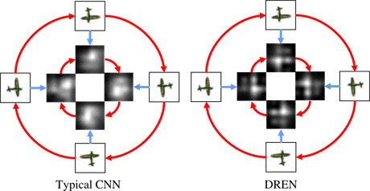
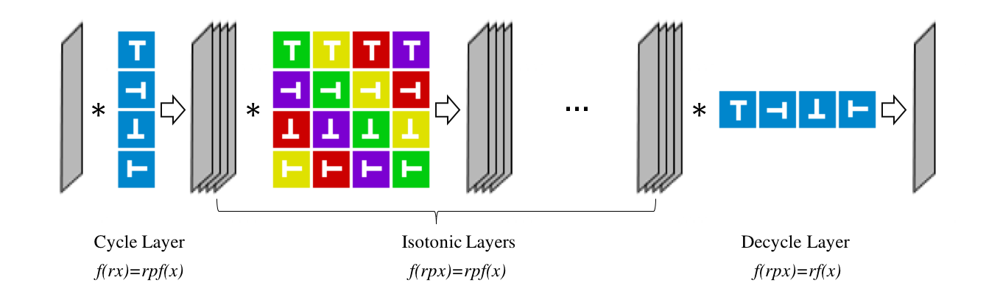
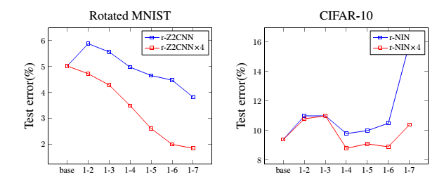
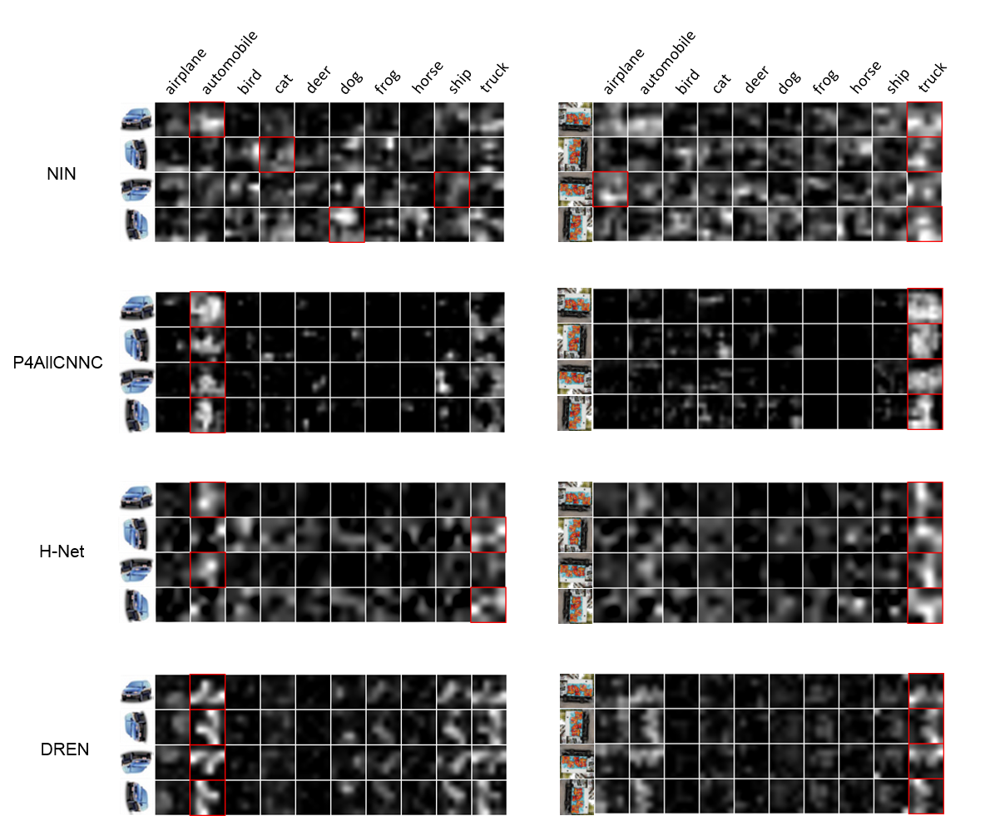

# DREN:Deep Rotation Equivirant Network
<div align="center">
  <br><br>
</div>

Features produced by a DREN is equivariant to rotation while that produced by a typical CNN is not. [Deep Rotation Equivirant Network](https://arxiv.org/abs/1705.08623)
## Installation
First, download caffe.

	git clone https://github.com/BVLC/caffe
	
Then, copy the files in ``DREN_ROOT/src/`` and  ``DREN_ROOT/include/`` to the corresponding directories in ``CAFFE_ROOT``.

Then the installation is the same as caffe.

- [Installation instructions](http://caffe.berkeleyvision.org/installation.html)

## Usage
<div align="center">
  <br><br>
</div>

Type these into prototxt file to force the convolutional layer to be our proposed layer.

	rot_in:true # cycle layer
	
	rot_hide:true # isotonic layer
	
	rot_out:true # decycle layer

For example

	layer {
	  name: "conv1"
	  type: "Convolution"
	  bottom: "data"
	  top: "conv1"
	
	  convolution_param {
	    num_output: 96
	    pad: 2
	    kernel_size: 5
	    rot_in:true # cycle layer
	  }
	}
More detailed examples are in ```DREN_ROOT/examples```
## Roated MNIST
### data
Down load data, and transform it into hdf5.

	cd DREN_ROOT/examples/rmnist
	sh get_data.sh
	matlab < mat2hdf5.m

### train model

	cd DREN_ROOT
	CAFFE_ROOT/build/tools/caffe train --solver examples/rmnist/r-z2cnn_x4/solver.prototxt

### performance


|Model          |Error     |Param. |
|---------------|----------|-------|
|SVM            |11.11%    |-      |
|Conv-RBM       |3.98%     |-      |
|P4CNN          |2.28%     |25k    |
|H-Net          |1.69%     |33k    |
|TI-pooling     |**1.20%** |13M    |
|Z2CNN(baseline)|5.03%     |22k    |
|r-Z2CNN        |3.82%     |**5k** |
|r-Z2CNNx4      |1.85%     |20k    |
|r-Z2CNN-max-x4 |**1.56%** |25k    |

## CIFAR-10
### data

We preprocess the data following the methods used in maxout networks and network in network paper. Please find the details [here](https://github.com/lisa-lab/pylearn2/tree/master/pylearn2/scripts/papers/maxout). 

To reproduce the results more easily, you can also download the Leveldb files [here](https://drive.google.com/file/d/0B3j4tSL88j-eU0c4NGd4NC0tUVU/view?usp=sharing) proposed by Saining Xie.

Download [cifar10_gcn-leveldb](https://drive.google.com/file/d/0B3j4tSL88j-eU0c4NGd4NC0tUVU/view?usp=sharing), save it in ``DREN_ROOT/examples/cifar10``

### train model

	cd DREN_ROOT
	CAFFE_ROOT/build/tools/caffe train --solver examples/cifar10/nin_r7_x4/solver.prototxt
### performance

|Model           |Error    |Param.  |
|----------------|---------|--------|
|NIN             |10.41%   |967k    |
|NIN*            |9.4%     |967k    |
|r-NIN(conv1-4)  |9.8%     |**576k**|
|r-NIN(conv1-4)x4|**9.0%** |958k    |
## How many isotonic layers should be applied?
<div align="center">
  <br><br>
</div>


**Classification error of models with different numbers of our proposed layers**: The left one is the results on Rotated MNIST and the right one is that on CIFAR-10. It turns out that, for datasets which has rotation symmetry in nature(Rotated MNIST), applying more isotonic layers yields better classification accuracy. We argue that higher level rotation equivariant representations learnt by stacking more isotonic layers improves the classification accuracy on such dataset. However, for CIFAR-10, the circumstance changes. Applying $4$ or $5$ isotonic layers achieves the best performance. We argue that higher level rotation equivariant representations are not helpful on such dataset without rotation symmetry, and applying more isotonic layers reduces the number of parameters(model complexity) fourfold, therefore leading to severe underfitting.

## Visualization
<div align="center">
  <br><br>
</div>


**The representations in the last convolutional layer learnt by NIN, H-Net, P4-ALL-CNN-C and DREN.** The two columns correspond to the representations of an image of automobile(left) and an image of truck(right). Inside one of the 8 pictures, the leftmost column contains the rotated input images while the remaining 10 columns contain the 10 feature maps in the last convolutional layers, which corresponds to the 10 classes of CIFAR-10. We slightly modify the architecture of H-Net to ensure that a global average pooling layer is used right after the last convolutional layer. The other three networks also apply this structure. Thus, the predictions of the networks are exactly the class whose related representation attains maximum density. We mark the maximal one(the prediction) with a red square. It turns out that when the input is rotated, NIN yields entirely different representations, leading to wrong predictions. For H-Net and P4-ALL-CNN-C, the representations are partly equivariant to rotation. However, H-Net still predicts incorrectly, when the image of automobile is rotated. In fact, only the representations of DREN are exactly equivariant to rotation, and thus the predictions of DREN are consistent, when the input is rotated. Moreover, we find our leanrt representations for automobile and for truck are very similar while that of other models are not. This shows that the representations learnt by DREN are similar for semantically similar objects, which indicates the reasonability of adding rotation equivariant constraint.


